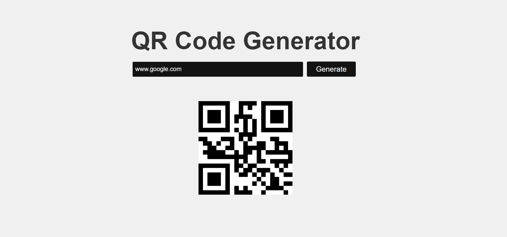

# QR Code Generator

This is a simple QR code generator built using React.js with TypeScript and CSS. It allows you to generate QR codes for various types of data, including URLs, text, and more. THE QR codes are being generated using the qrcode.react library.

Here is an image of the frontend for the project:

To run the project, follow these steps:
First, install all dependencies using the following commands:
- npm install
- npm install @mui/material @emotion/react @emotion/styled

To run the project, use the following command:
- npm run dev